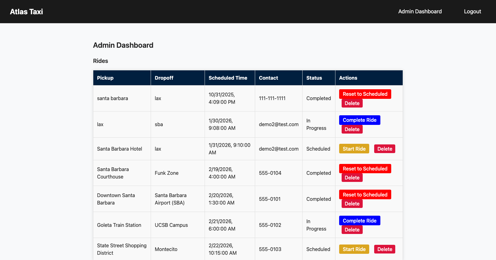

# Atlas Taxi - Backend API

**Full-Stack Development Project**

Originally built as a full-stack capstone project, it has since expanded with production-style features like role-based auth, an admin dashboard, and ongoing polish. RESTful API backend for a ride-booking application, demonstrating secure authentication, authorization, and database management with the MERN stack.



## 🚀 Live Deployment

**Frontend:** https://atlastaxi.netlify.app  
**Backend:** Deployed on Render

> **Note:** This is a portfolio/demo project, so all data is for testing only. Please don't enter real personal information. Anything that isn't part of the demo may get cleared out from time to time.

## Features

- 🔐 JWT-based authentication with token verification
- 🔒 bcrypt password hashing
- 👥 Role-based access control (user/admin)
- 🚕 Ride booking and management system
- 📊 Admin dashboard endpoints
- 🛡️ Protected routes with middleware
- 🌐 CORS-enabled API
- 📝 Request logging and security headers
- ⏱️ Automatic token expiration (1 hour)
- 👤 User profile data in login response

## Tech Stack

- **Runtime:** Node.js
- **Framework:** Express.js
- **Database:** MongoDB with Mongoose ODM
- **Authentication:** JWT (jsonwebtoken) + bcrypt
- **Security:** Helmet, CORS
- **Dev Tools:** nodemon, Morgan (logging), dotenv

## API Endpoints

### Authentication
```
POST /api/auth/user-register    Register new user
POST /api/auth/user-login       User login (returns JWT + user details)
POST /api/auth/admin-register   Register new admin
POST /api/auth/admin-login      Admin login (returns JWT)
```

### Rides (Protected)
```
POST   /api/rides      Book a new ride
GET    /api/rides      Get user's rides (or all for admin)
PATCH  /api/rides/:id  Update ride status
DELETE /api/rides/:id  Delete ride
```

### Users (Admin-only)
```
GET /api/user        Get all users
GET /api/user/:id    Get user by ID
```

### Admin (Protected)
```
GET    /api/admin/dashboard  Get dashboard statistics
GET    /api/admin/data       Get admin data
DELETE /api/admin/:id        Delete admin
```

## Data Models

### User
```javascript
{
  firstName: String,
  lastName: String,
  email: String (unique),
  password: String (hashed),
  timestamps: true
}
```

### Admin
```javascript
{
  username: String (unique),
  email: String (unique),
  password: String (hashed),
  timestamps: true
}
```

### Ride
```javascript
{
  pickupLocation: String,
  dropoffLocation: String,
  scheduledTime: Date,
  contactInfo: String,
  status: Enum ["Scheduled", "In Progress", "Completed", "Cancelled"],
  rider: ObjectId (ref: User),
  driver: ObjectId (ref: User),
  fare: Number,
  timestamps: true
}
```

## Getting Started

### Prerequisites
- Node.js (v14 or higher)
- MongoDB (local installation or MongoDB Atlas)
- npm or yarn

### Installation

1. **Clone the repository**
```bash
git clone https://github.com/alikirat/atlas-taxi-backend
cd atlas-taxi-backend
```

2. **Install dependencies**
```bash
npm install
```

3. **Environment Setup**

Create a `.env` file in the root directory (see `.env.example`):
```env
MONGODB_URI=your_mongodb_connection_string
JWT_SECRET=your_secret_key_here
PORT=4000
```

4. **Start the server**
```bash
# Development mode with auto-reload
npm run dev

# Production mode
npm start
```

Server will run on `http://localhost:4000`

## Testing

The test suite uses Vitest and Supertest against an in-memory MongoDB
(`mongodb-memory-server`), so it never touches a real database:

```bash
npm test
```

Tests live in `tests/` and cover auth (register/login), admin-only access
to `/api/user`, and ride booking/ownership (including that a rider can only
update, cancel, or view their own rides).

## Project Structure
```
atlas-taxi-backend/
├── models/
│   ├── User.js           User schema
│   ├── Admin.js          Admin schema
│   └── Ride.js           Ride schema
├── routes/
│   ├── auth.js           Authentication routes
│   ├── user.js           User routes
│   ├── admin.js          Admin routes
│   ├── ride.js           Ride routes
│   └── health.js         Health check
├── middleware/
│   └── authenticateJWT.js  JWT verification
├── tests/                Vitest + Supertest suite
├── .env.example          Environment template
├── .gitignore
├── app.js                Express app (routes, middleware)
├── index.js              Server entry point (DB connect + listen)
└── package.json
```

## Authentication Flow

1. User registers → password hashed with bcrypt → stored in MongoDB
2. User logs in → credentials verified → JWT token generated (1h expiration)
3. Backend returns token + user details (firstName, lastName, email)
4. Client stores token → sends in Authorization header: `Bearer <token>`
5. Protected routes → middleware verifies token → grants access

## Security Features

- Password hashing with bcrypt (salt rounds: 10)
- JWT tokens with 1-hour expiration
- Environment variables for secrets
- CORS configuration for allowed origins
- Helmet for security headers
- Input validation on all endpoints
- Token verification middleware

## Deployment

**Platform:** Render Free Tier  
**Database:** MongoDB Atlas Free Tier (M0)  
**Monitoring:** UptimeRobot (health check every 14 minutes)

### Free Tier Considerations

**Cold Starts:**
- Render free tier spins down after 15 minutes of inactivity
- First request after sleep takes 30-60 seconds to wake up
- UptimeRobot pings `/api/health` every 14 minutes to minimize cold starts
- Frontend displays user-friendly message during wake-up period

**Production Recommendations:**
- **Hosting:** Render Starter ($7/month) or Railway - eliminates cold starts
- **Database:** MongoDB Atlas M10 ($57/month) - automatic backups, better performance
- **Monitoring:** Upgrade to paid monitoring for SLA guarantees
- **Total Cost:** ~$70/month for professional-grade deployment

### Environment Variables (Set in Render Dashboard)
```env
MONGODB_URI=your_mongodb_atlas_connection_string
JWT_SECRET=your_secret_key_minimum_32_characters
PORT=4000
```

### Health Check Endpoint
```
GET /api/health
```

Returns `{"status": "ok"}` when server is running. Used by UptimeRobot for monitoring.

## Related Repository

**Frontend:** [https://github.com/alikirat/atlas-taxi-frontend](https://github.com/alikirat/atlas-taxi-frontend)

---

**Built as part of a full-stack development capstone project demonstrating backend API development and security best practices.**